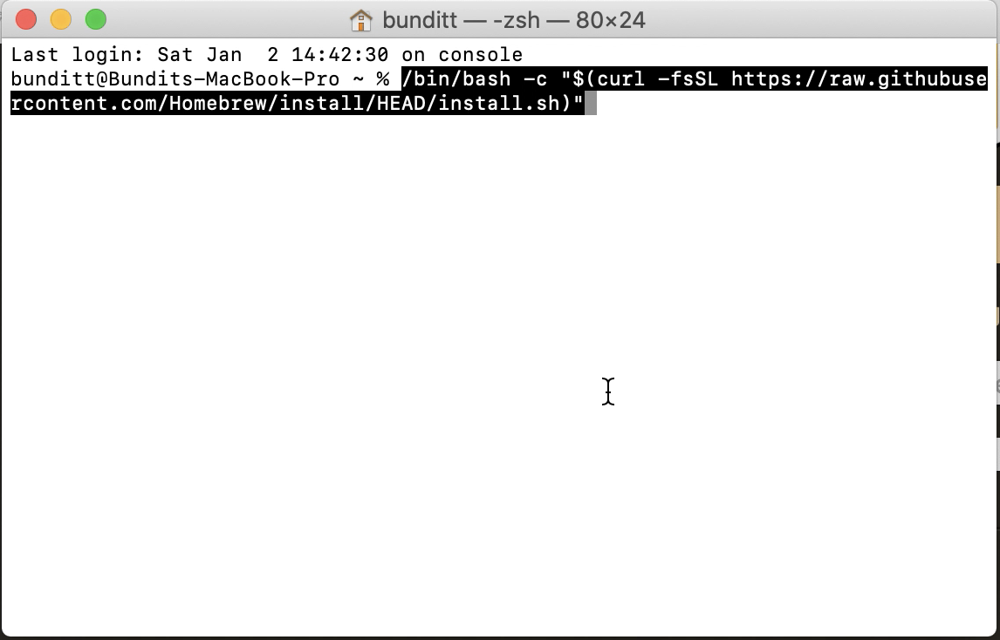

# เตรียมความพร้อมเครื่อง Mac สำหรับวิชา Web Programming

---

## โปรแกรมที่ต้องใช้
* Homebrew
* NodeJS
* MySQL database
* VSCode
* VSCode Live Server
* Postman

---

### 1. ติดตั้ง Homebrew

คิดว่าหลายคนคงรู้จัก Homebrew แล้ว ถ้าใครไม่รู้่จัก Home brew เป็นโปรแกรมประเภท Package Manager ที่ทำหน้าจัดการกับ Package ต่าง ๆ  
  
เอาแบบเข้าใจง่าย ๆ คือ Homebrew จะช่วยเรา install/update/uninstall โปรแกรมต่าง ๆ นั่นเองครับ 
(อาจจะมองว่าเป็น App Store ของสาย Dev ก็ได้ครับ)

ทำการติดตั้ง Homebrew โดยรันคำสั่งต่อไปนี้ใน `terminal`
```
$ /bin/bash -c "$(curl -fsSL https://raw.githubusercontent.com/Homebrew/install/HEAD/install.sh)
```

<details>
    1. เปิด `Terminal`
    <br/>
    2. Paste คำสั่งต้านบนลงไปใน Terminal และกด Enter
    <br/>
    3. กรอกรหัสผ่าน
    

</details>  
<br>

ตรวจสอบว่า Homebrew ติดตั้งสำเร็จ
```
$ brew help
```

<details>
    
</details>
<br>

### 2. ติดตั้ง Nodejs

Nodejs เป็น runtime ภาษา javascript ที่ช่วยให้เราสามารถรันโค๊ด javascript นอก เว็บเบราเซอร์ได้

ถ้าเรามี Homebrew อยู่ในเครื่องแล้ว การติดตั้ง nodejs ก็แสนจะง่ายดาย

โดยรันคำสั่งต่อไปนี้ใน Terminal
```
brew install node
```

<details>
    
</details>
<br>

ตรวจสอบว่า Nodejs ติดตั้งสำเร็จ
```
$ node --version
```

ถ้าได้ผลลัพธ์ตามตัวอย่างด้านล่าง แสดงว่าติดตั้งเรียบร้อยแล้ว (เลข version อาจจะแตกต่างกันออกไป ก็ไม่เป็นไรครับ)
```
v15.5.0
```

### 3. ติดตั้งฐานข้อมูล MySQL

MySQL เป็นโปรแกรมจัดการฐานข้อมูล หรือ Relational Database Management System (RDBMS)
เราสามารถติดตั้ง MySQL ได้ผ่าน Homebrew เช่นกัน

โดยรันคำสั่งต่อไปนี้ใน Terminal
```
brew install mysql
```

<details>
    
</details>
<br>

สั่งให้ MySQL เริ่มทำงานอัตโนมัติทุกครั้งที่เปิดคอมขึ้นมา
```
brew services start mysql
```
<details>
    
</details>
<br>

โดยปกติแล้วฐานข้อมูลที่ติดตั้งใหม่จะไม่มีรหัสผ่าน เราสามารถทำให้ฐานข้อมูลของเราปลอดภัยมากขี้นโดยใช้คำสั่ง

❗️❗️❗️<ins>**คำเตือน** เป็นเรื่องเศร้าที่สุดอย่างนึงในชีวิตถ้าลืมรหัสผ่านฐานข้อมูล (root password)</ins>❗️❗️❗️  
😭😭😭 ผมเคยลองแล้ว ทุกคนไม่ต้องทำตามนะครับ
```
mysql_secure_installation
```
<details>
    
</details>
<br>

ถ้าใช้ในเครื่อง Production ที่ต้องการความปลอดภัยสูงแนะนำให้ตอบ y (yes) ทั้งหมด  
แต่ตอนนี้เราใช้งานในระดับ Development แนะนำให้ตอบ n (no) ทั้งหมดเพื่อให้ใช้งานได้ง่ายครับ  


### 4. ติดตั้ง Visual Studio Code (VSCode)
VSCode เป็นโปรแกรม text editor ยอดนิยมในการเขียนโค๊ด สามารถดาวโหลดน์มาติดตั้งได้เหมือนโปรแกรมทั่วไป [download](https://code.visualstudio.com/)


### 5. ติดตั้ง Live Server Extension สำหรับ VSCode
Live Server เป็น ส่วนขยาย (Extension) สำหรับ VSCode  
เจ้า Live Server ตัวนี้จะช่วย refresh หน้าเว็บของเราโดยอัตโนมัติเมื่อเราทำการ save ไฟล์

วิธีการติดตั้ง Extension ใน VSCode
1. เปิดโปรแกรม VSCode และเลือกที่เมนู Extension 
2. ค้นหาคำว่า "Live Server"
3. เลือก Live Server ของคุณ "Ritwick Dey" กดปุ่ม Install
<details>
    
</details>
<br>

4. รอจน Install เสร็จ จากนั้นปิดโปรแกรม VSCode และเปิดขึ้นมาใหม่


### 6. Postman
Postman เป็น REST API Client สามารถช่วยเราในการทดสอบ API ที่เราจะสร้างขึ้นมา  
สามารถดาวโหลดน์มาติดตั้งได้เหมือนโปรแกรมทั่วไป [download](https://www.postman.com/downloads/)